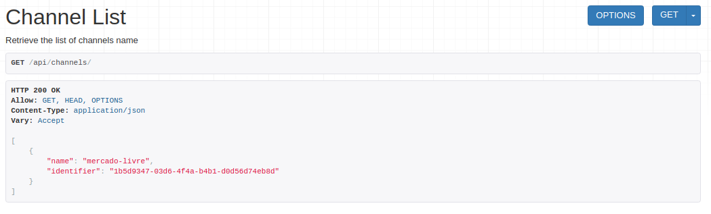
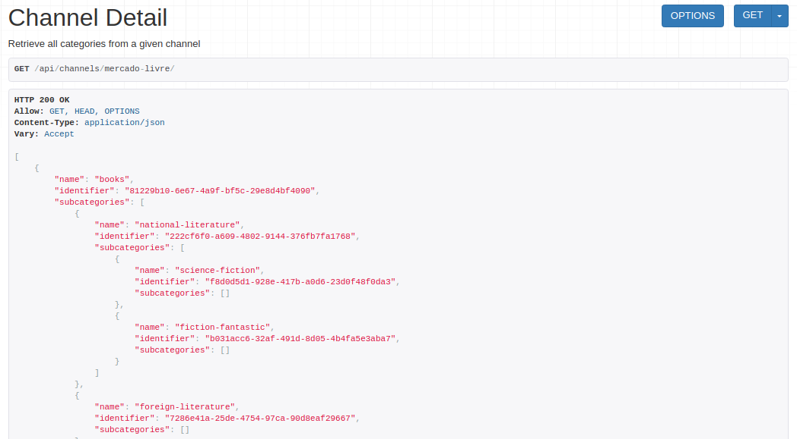
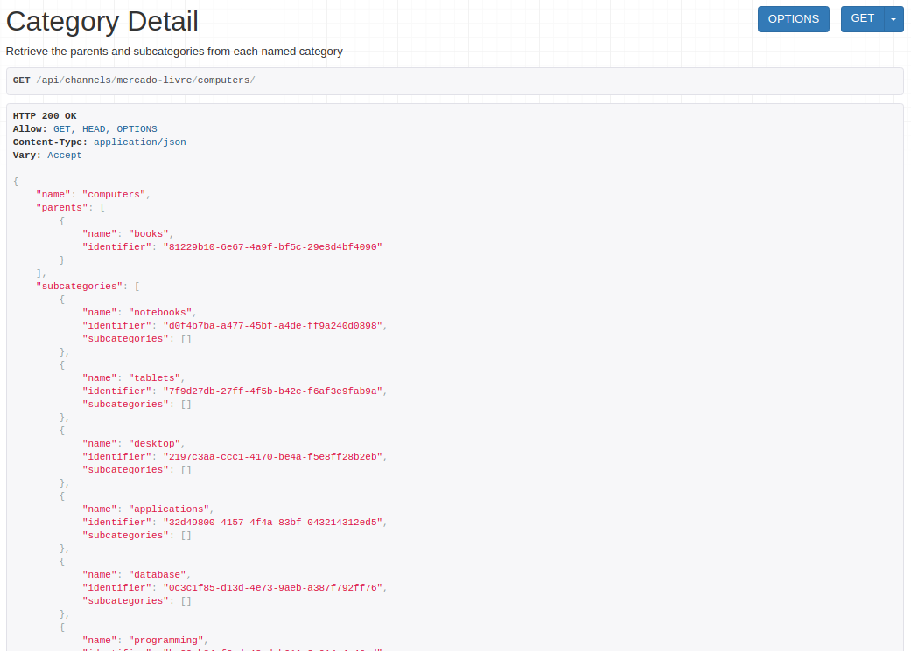

# Description

Implementation of work-at-olist test about processing channels & categories for marketplaces. 

## Libraries

| Library               | Version       |
| :-------------------- | ------------- |
| Django                | 1.11          |
| Django Rest Framework | 3.6.2         |

## Environment

| Environment       | Description             |
| :---------------- | :------------------     |
| Computer          | Notebook Dell D620      |
| Operating System  | Linux 4.7.10 @ Manjaro  |
| Editors           | Sublime Text & Emacs    |
| Python Version    | 3.6.0                   |
| CI                | CircleCI                |
| Coverage          | Codecov                 |

# API REST Docs

Deployed on Heroku at [olist-ryukinix.herokuapp.com](https://olist-ryukinix.herokuapp.com)

Routes:

* GET `/api/channels/`
* GET `/api/channels/<channel_name>/`
* GET `/api/channels/<channel_name>/<category_name>/`

## Channel List
Retrieve a list of channels. Each entry have the fields `name` and `identifier`.

Example: GET [`/api/channels/`](https://olist-ryukinix.herokuapp.com/api/channels/)

## Channel Detail
Retrieve a list of all categories that belongs to a given channel. Return in nested mode
like a category tree ordered by parents and subcategories. Each entry has a `name`, `identifier` and may have a list of `subcategories` with this same properties described.

Example: GET [`/api/channels/mercado-livre/`](https://olist-ryukinix.herokuapp.com/api/channels/mercado-livre/)

## Category Detail
Retrieve the parents and subcategories of given a category and its channel. A unique
entry with the `name`, and a list of `parents` and `subcategories` of the given category.

Example: GET [`/api/channels/mercado-livre/computers/`](https://olist-ryukinix.herokuapp.com/api/channels/mercado-livre/computers/)
